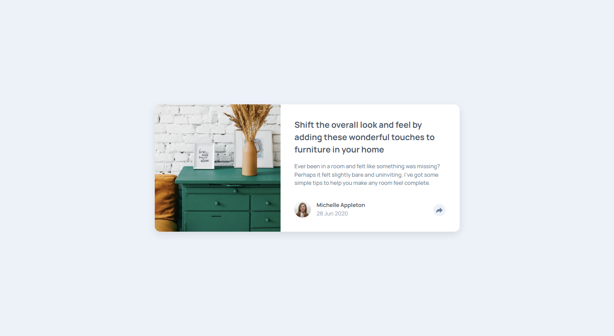

# Frontend Mentor - Article preview component solution

This is a solution to the [Article preview component challenge on Frontend Mentor](https://www.frontendmentor.io/challenges/article-preview-component-dYBN_pYFT). Frontend Mentor challenges help you improve your coding skills by building realistic projects. 

### Links

- Solution URL: [https://www.frontendmentor.io/solutions/article-preview-component-zTM2XQMCY](https://www.frontendmentor.io/solutions/article-preview-component-zTM2XQMCY)
- Live Site URL: [https://vencertorres.github.io/frontend-mentor-challenges/article-preview-component/](https://vencertorres.github.io/frontend-mentor-challenges/article-preview-component/)

### Built with

- Semantic HTML5 markup
- Flexbox
- CSS Animations
- Mobile-first workflow

## Author

- Frontend Mentor - [@vencertorres](https://www.frontendmentor.io/profile/vencertorres)
