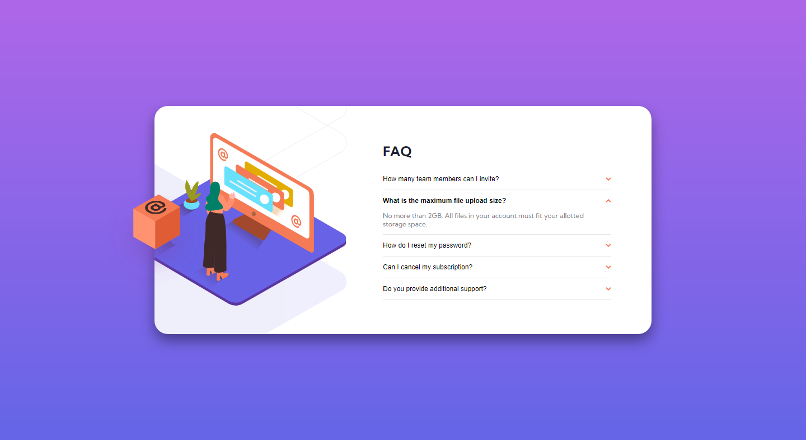

# Frontend Mentor - FAQ accordion card solution

This is a solution to the [FAQ accordion card challenge on Frontend Mentor](https://www.frontendmentor.io/challenges/faq-accordion-card-XlyjD0Oam).

### Links

- Solution URL: [https://www.frontendmentor.io/solutions/faq-accordion-card-NIl3yJjEc](https://www.frontendmentor.io/solutions/faq-accordion-card-NIl3yJjEc)
- Live Site URL: [https://vencertorres.github.io/frontend-mentor-challenges/faq-accordion-card](https://vencertorres.github.io/frontend-mentor-challenges/faq-accordion-card/)

### Built with

- Semantic HTML5 markup
- CSS custom properties
- Flexbox
- Mobile-first workflow

## Author

- Frontend Mentor - [@vencertorres](https://www.frontendmentor.io/profile/vencertorres)
