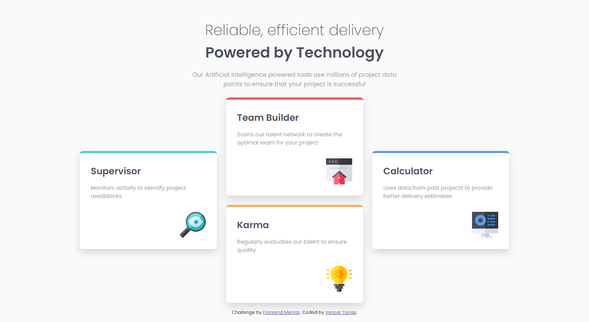

# Frontend Mentor - Four card feature section solution

This is a solution to the [Four card feature section challenge on Frontend Mentor](https://www.frontendmentor.io/challenges/four-card-feature-section-weK1eFYK). Frontend Mentor challenges help you improve your coding skills by building realistic projects. 

## Table of contents

- [Overview](#overview)
  - [The challenge](#the-challenge)
  - [Screenshot](#screenshot)
  - [Links](#links)
- [Author](#author)

### Screenshot

### Links

- Solution URL: [https://www.frontendmentor.io/solutions/four-card-feature-section-using-css-grid-UhdvVzI-h](https://www.frontendmentor.io/solutions/four-card-feature-section-using-css-grid-UhdvVzI-h)
- Live Site URL: [https://vencertorres.github.io/frontend-mentor-solutions/four-card-feature-section](https://vencertorres.github.io/frontend-mentor-solutions/four-card-feature-section)

## My process

### Built with

- Semantic HTML5 markup
- CSS custom properties
- CSS Grid
- Mobile-first workflow

## Author

- Frontend Mentor - [@vencertorres](https://www.frontendmentor.io/profile/vencertorres)
