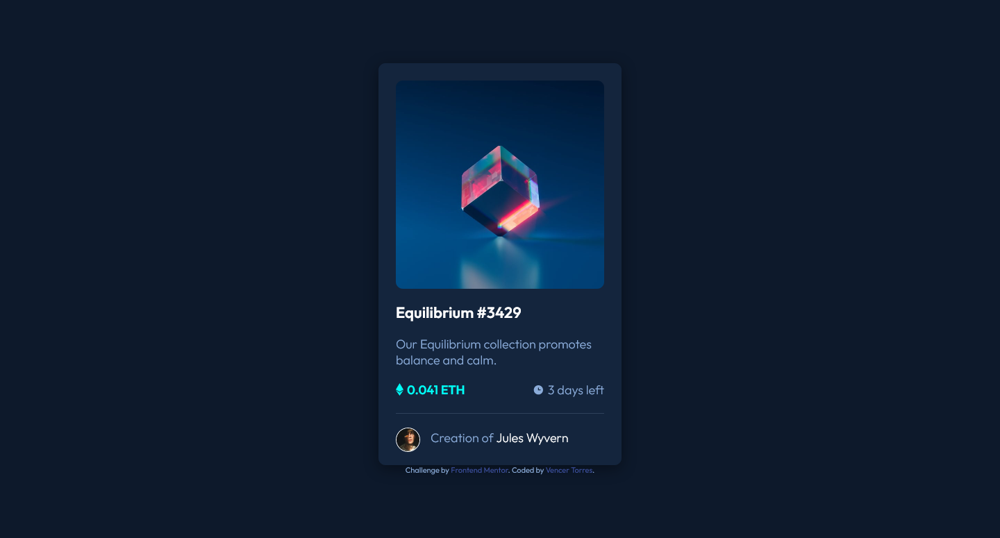

# Frontend Mentor - NFT preview card component solution

This is a solution to the [NFT preview card component challenge on Frontend Mentor](https://www.frontendmentor.io/challenges/nft-preview-card-component-SbdUL_w0U). Frontend Mentor challenges help you improve your coding skills by building realistic projects. 

## Table of contents

- [Overview](#overview)
  - [The challenge](#the-challenge)
  - [Screenshot](#screenshot)
  - [Links](#links)
- [My process](#my-process)
  - [Built with](#built-with)
  - [Useful resources](#useful-resources)
- [Author](#author)

## Overview

### The challenge

Users should be able to:

- View the optimal layout depending on their device's screen size
- See hover states for interactive elements

### Screenshot

### Links

- Solution URL: [https://www.frontendmentor.io/solutions/nft-preview-card-component-flexbox-OttFkoplh](https://www.frontendmentor.io/solutions/nft-preview-card-component-flexbox-OttFkoplh)
- Live Site URL: [https://vencertorres.github.io/frontend-mentor-challenges/nft-preview-card-component/](https://vencertorres.github.io/frontend-mentor-challenges/nft-preview-card-component/)

## My process

### Built with

- Semantic HTML5 markup
- Flexbox
- Mobile-first workflow

### Useful resources

- [Interneting Is Hard](https://www.internetingishard.com/) - Great resource for beginners wanting to learn HTML & CSS.
- [A Complete Guide to Flexbox](https://css-tricks.com/snippets/css/a-guide-to-flexbox/) - In addition to [Interneting Is Hard](https://www.internetingishard.com/), this article helped me fully understand Flexbox. I'd recommend it to anyone still learning this concept.

## Author

- Frontend Mentor - [@vencertorres](https://www.frontendmentor.io/profile/vencertorres)
