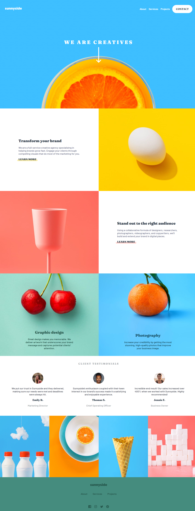
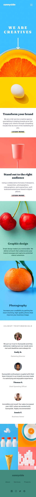

# Frontend Mentor - Sunnyside agency landing page solution

This is a solution to the [Sunnyside agency landing page challenge on Frontend Mentor](https://www.frontendmentor.io/challenges/sunnyside-agency-landing-page-7yVs3B6ef). Frontend Mentor challenges help you improve your coding skills by building realistic projects.

### Links

- Solution URL: [https://www.frontendmentor.io/solutions/sunnyside-agency-landing-page-uiPBYUaWFa](https://www.frontendmentor.io/solutions/sunnyside-agency-landing-page-uiPBYUaWFa)
- Live Site URL: [https://vencertorres.github.io/frontend-mentor-challenges/sunnyside-agency-landing-page-main/](https://vencertorres.github.io/frontend-mentor-challenges/sunnyside-agency-landing-page-main/)

## My process

### Built with

- Semantic HTML5 markup
- CSS custom properties
- Flexbox
- CSS Grid
- Mobile-first workflow
- JavaScript

## Author

- Frontend Mentor - [@vencertorres](https://www.frontendmentor.io/profile/vencertorres)
