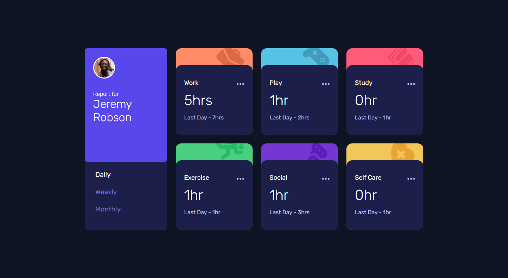

# Frontend Mentor - Time tracking dashboard solution

This is a solution to the [Time tracking dashboard challenge on Frontend Mentor](https://www.frontendmentor.io/challenges/time-tracking-dashboard-UIQ7167Jw). Frontend Mentor challenges help you improve your coding skills by building realistic projects. 

### Links

- Solution URL: [https://github.com/vencertorres/frontend-mentor-solutions/time-tracking-dashboard/](https://github.com/vencertorres/frontend-mentor-solutions/time-tracking-dashboard/)
- Live Site URL: [https://vencertorres.github.io/frontend-mentor-solutions/time-tracking-dashboard/dist](https://vencertorres.github.io/frontend-mentor-solutions/time-tracking-dashboard/dist)

## My process

### Built with

- Semantic HTML5 markup
- CSS custom properties
- Flexbox
- CSS Grid
- Mobile-first workflow
- [React](https://reactjs.org/) - JS library
- [Styled Components](https://styled-components.com/) - For styles

## Author

- Frontend Mentor - [@vencertorres](https://www.frontendmentor.io/profile/vencertorres)
